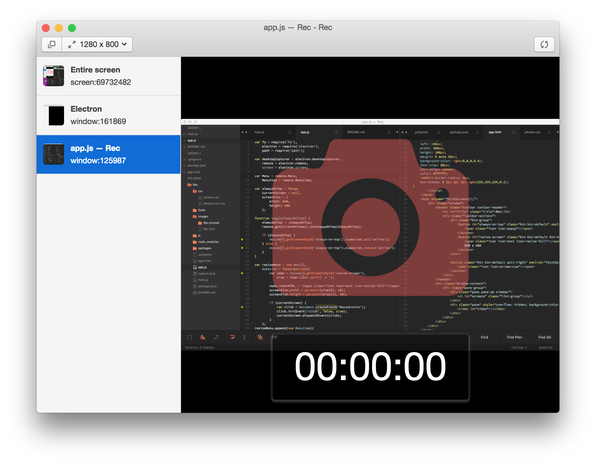

# Rec

> Desktop screen recording app.



## Features

* Recording the your desktop or application window
* Select the recording size

## Download

[Releases](https://github.com/k0sukey/Rec/releases)

## Develop

```sh
$ git clone git@github.com:k0sukey/Rec.git
$ cd Rec
$ npm start
```

## Built with

* [Electron](http://electron.atom.io)
* [Photon](http://photonkit.com)
* [Whammy](https://github.com/antimatter15/whammy)

## License

MIT